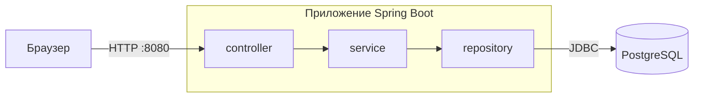

# StudyNotes

[](https://github.com/ValeriiKravchenko/studynotes/actions/workflows/ci.yml)

Персональная система для работы с IT-заметками. Импорт из Obsidian, полнотекстовый поиск, рендеринг Markdown с оглавлением и коллаутами, живой интерфейс без перезагрузки страницы.

---

## О проекте

StudyNotes решает конкретную проблему: вместо поиска по файлам и повторных запросов — набрал тему, получил все свои конспекты в одном месте. Приложение импортирует `.md` файлы из Obsidian (zip-архивом), сохраняя структуру папок, рендерит Markdown в HTML и предоставляет полнотекстовый поиск по всей базе заметок.

---

## Возможности

- **Импорт из Obsidian** — zip-архив с `.md` файлами загружается через `POST /api/import`, заметки создаются с сохранением иерархии папок. Дубликаты (по заголовку) пропускаются, заголовок извлекается из `# H1` или из имени файла. Подробности в разделе «Импорт».
- **Markdown-рендеринг** — заголовки, списки, таблицы, блоки кода с подсветкой синтаксиса (Prism.js), чек-листы, зачёркнутый текст.
- **Коллауты Obsidian** — поддержка `[!note]`, `[!tip]`, `[!warning]`, `[!danger]`, `[!info]` с возможностью сворачивания.
- **Оглавление** — автоматическая генерация из H2/H3 заголовков с якорными ссылками.
- **Полнотекстовый поиск** — PostgreSQL `tsvector` + `ts_rank` по русскоязычному контенту.
- **Живой поиск** — результаты обновляются при вводе без перезагрузки страницы (HTMX).
- **Папки** — древовидная структура с фильтрацией, счётчиками заметок, вложенными подпапками.
- **HTMX-интерактивность** — переключение папок, удаление заметок без перезагрузки.
- **Темы оформления** — 10 цветовых палитр, выбор сохраняется в localStorage.
- **Аутентификация** — Spring Security, кастомная страница логина, CSRF-защита включая HTMX-запросы.
- **CRUD** — создание, просмотр, редактирование, удаление заметок через веб-интерфейс и REST API.
- **Markdown-редактор** — toolbar с кнопками форматирования, вставка коллаутов через выпадающее меню.

---

## Стек технологий

**Backend:**
Java 21, Spring Boot 4.0.3, Spring MVC, Spring Data JPA, Spring Security, Hibernate (режим `validate`), PostgreSQL 16, Flyway (миграции схемы)

**Frontend:**
Thymeleaf, HTMX, Bootstrap 5, Prism.js (библиотеки подключаются с публичных CDN, для работы интерфейса нужен доступ в интернет)

**Markdown:**
flexmark-java (GFM-таблицы, чек-листы, зачёркивание) + кастомный парсер коллаутов

**Тестирование:**
JUnit 5, Mockito, Spring Security Test, Testcontainers (PostgreSQL)

**Инфраструктура:**
Docker, Docker Compose (многоэтапная сборка образа), GitHub Actions (CI), Dependabot (обновление зависимостей)

---

## Архитектура

Трёхслойная архитектура с чётким разделением ответственности:



- **Controller** — REST API (`NoteController`, `FolderController`, `ImportController`) и веб-интерфейс (`NoteWebController`, `HomeController`)
- **Service** — бизнес-логика: `NoteService`, `ImportService`, `MarkdownService`, `FolderService`
- **Repository** — доступ к данным через Spring Data JPA с кастомными запросами
- **DTO** — `NoteRequest` / `NoteResponse` и `FolderResponse` для разделения API и модели данных
- **Mapper** — `NoteMapper` для конвертации Entity ↔ DTO
- **Exception** — `GlobalExceptionHandler` приводит ошибки API к единому формату `ErrorResponse`; `InvalidReferenceException` сообщает о ссылке на несуществующую запись в теле запроса (например, `folderId`), `FolderNotFoundException` и `NoteNotFoundException` — об отсутствующих папке и заметке

```
src/main/java/com/val/studynotes/
├── config/          SecurityConfig, WebConfig
├── controller/      NoteController, FolderController, ImportController,
│                    NoteWebController, HomeController
├── dto/             NoteRequest, NoteResponse, FolderResponse, ImportResult,
│                    ErrorResponse, HeadingInfo, ...
├── exception/       NoteNotFoundException, FolderNotFoundException, InvalidReferenceException,
│                    ImportRejectedException, GlobalExceptionHandler
├── mapper/          NoteMapper
├── model/           Note, Folder
├── repository/      NoteRepository, FolderRepository, FolderNoteCount
└── service/         NoteService, ImportService, MarkdownService,
                     FolderService, TitleExtractor, FolderResolver

src/main/resources/db/migration/   миграции Flyway (V1, V2, V3)
```

## База данных и миграции

Схема создаётся миграциями Flyway при старте приложения (`src/main/resources/db/migration/`), Hibernate только проверяет её (`spring.jpa.hibernate.ddl-auto=validate`):

- `V1__baseline.sql` — таблицы `folders` и `notes`;
- `V2__fulltext_index.sql` — GIN-индекс для полнотекстового поиска (`to_tsvector('russian', ...)`);
- `V3__indexes.sql` — индексы по внешним ключам и заголовку, уникальность имени папки в пределах родителя.

Если база была создана старой версией приложения, когда схему создавал Hibernate, Flyway откажется стартовать на непустой схеме без таблицы истории миграций (ошибка «Found non-empty schema(s) ... but no schema history table»). Для проекта без боевых данных решение такое: `docker compose down -v` (данные будут удалены).

---

## Как запустить

### Требования

- Docker и Docker Compose

### Запуск

```bash
# 1. Клонировать репозиторий
git clone https://github.com/ValeriiKravchenko/studynotes.git
cd studynotes

# 2. Создать файл .env (по примеру .env.example)
cp .env.example .env
nano .env    # Заполнить реальными значениями

# 3. Собрать образ и запустить
docker compose up -d --build

# 4. Открыть
# http://localhost:8080
```

Вход выполняется логином и паролем из `.env` (`SECURITY_USERNAME`, `SECURITY_PASSWORD`). Схема базы создаётся миграциями Flyway при первом старте.

### Переменные окружения (.env)

`docker-compose.yml` читает из `.env` три переменные и сам передаёт их приложению:

```
DB_PASSWORD=пароль_базы_данных
SECURITY_USERNAME=имя_пользователя
SECURITY_PASSWORD=пароль_для_входа
```

Внутри контейнера приложения compose задаёт `SPRING_DATASOURCE_URL`, `SPRING_DATASOURCE_USERNAME`, `SPRING_DATASOURCE_PASSWORD`, `APP_SECURITY_USERNAME` и `APP_SECURITY_PASSWORD`. Менять их в `.env` не нужно.

Запуск приложения без Docker Compose (например, из IDE) описан в `application.properties` другими именами: `DB_USERNAME`, `DB_PASSWORD`, `STUDYNOTES_USERNAME`, `STUDYNOTES_PASSWORD`; адрес базы там `localhost:5432/studynotes`.

### Порты и безопасность

- Приложение публикуется на `8080` по обычному HTTP, без TLS и reverse proxy. Для доступа из интернета HTTPS нужно настроить самостоятельно.
- PostgreSQL публикуется на хостовый порт `5432` (`"5432:5432"` в `docker-compose.yml`) на всех интерфейсах хоста. Если хост доступен из сети, ограничьте доступ к этому порту файрволом или измените проброс порта.

### Остановка

```bash
docker compose down        # Остановить (данные сохраняются)
docker compose down -v     # Остановить + удалить данные
```

---

## Тестирование

```bash
# Нужны Java 21 и запущенный Docker
./mvnw test
```

Часть тестов использует Testcontainers и поднимает настоящий PostgreSQL в контейнере, поэтому Docker должен быть запущен. Без Docker эти тесты пропускаются, а не падают: «зелёный» прогон без Docker не означает, что они прошли.

Покрытие по областям:

- **Сервисы** — `NoteService`, `FolderService`, `FolderResolver`, `TitleExtractor`, `MarkdownService` (рендеринг, заголовки, санитизация HTML).
- **Контроллеры** — REST API заметок (фильтр по папке, поиск, `folderId` в теле запроса) и папок, веб-контроллер главной страницы, импорт, формат ошибок (`GlobalExceptionHandler`), маппер `NoteMapper`.
- **Безопасность** — доступ только после входа, CSRF, конфигурация `SecurityConfig`.
- **Папки и поиск через API** — `GET /api/folders` (плоский список, счётчики прямых заметок), `GET /api/notes?folderId=`, `GET /api/notes/search` (пустой запрос, лимит длины, отсутствие параметра), ошибка `folderId` в `POST`/`PUT`.
- **Миграции и поиск на PostgreSQL** — применение миграций Flyway на пустой базе, соответствие схемы сущностям (`validate`), полнотекстовый индекс и поиск, уникальность имён папок.
- **Импорт zip** — разбор архива, вложенные папки, дубликаты, лимиты, небезопасные имена, некорректная кодировка и не-zip файлы, лимит размера загрузки.

### CI

GitHub Actions (`.github/workflows/ci.yml`, workflow `CI`) запускает `./mvnw -B verify` на каждый push в `main` и на каждый pull request. Раннер использует Docker, поэтому тесты на Testcontainers выполняются. Если в отчётах surefire есть пропущенные тесты, прогон считается неуспешным.

### Обновление зависимостей

Dependabot (`.github/dependabot.yml`) раз в неделю проверяет зависимости Maven, действия GitHub Actions и базовые образы Docker (`Dockerfile` и `docker-compose.yml`). Мажорные обновления Spring Boot в автоматическом режиме не предлагаются: переход на новую мажорную версию делается отдельным решением.

---

## API

REST API доступен параллельно с веб-интерфейсом. Все запросы требуют аутентификации (вход через форму `/login`), изменяющие запросы (`POST`, `PUT`, `DELETE`) требуют CSRF-токен. Ошибки возвращаются в формате `ErrorResponse` (JSON).

### Заметки

| Метод | URL | Описание |
|-------|-----|----------|
| GET | `/api/notes` | Список всех заметок; с `?folderId=<id>` только заметки этой папки |
| GET | `/api/notes/search?query=...` | Полнотекстовый поиск |
| GET | `/api/notes/{id}` | Заметка по ID |
| POST | `/api/notes` | Создать заметку |
| PUT | `/api/notes/{id}` | Обновить заметку |
| DELETE | `/api/notes/{id}` | Удалить заметку |

Тело запроса `NoteRequest`: `title` (обязательно, до 255 символов), `content` (до 200000 символов), `folderId` (необязательно, ID папки).

- `PUT` заменяет заметку целиком: если `folderId` равен `null` или поля нет в теле, папка у заметки снимается.
- Несуществующий `folderId` в `POST` или `PUT` даёт 400 с `fieldErrors` по полю `folderId`. Нечисловое значение даёт 400 без `fieldErrors`.
- `GET /api/notes?folderId=<id>` возвращает заметки папки; без параметра возвращаются все заметки. Нечисловой `folderId` даёт 400.
- `GET /api/notes/search?query=...` ищет по заголовку и содержимому средствами PostgreSQL с конфигурацией `russian`. `query` не длиннее 200 символов, иначе 400. Пустой или состоящий из пробелов запрос даёт `[]`. Без параметра `query` возвращается 400.

### Папки

| Метод | URL | Описание |
|-------|-----|----------|
| GET | `/api/folders` | Плоский список всех папок |

Элемент списка (`FolderResponse`): `id`, `name`, `parentId` (`null` у корневых папок), `noteCount`. В `noteCount` считаются только заметки, лежащие непосредственно в папке, без вложенных. Дерево клиент собирает по `parentId`. Создание, переименование и удаление папок через API не поддерживаются: папки появляются при импорте.

### Ошибки

Ошибки API возвращаются в формате `ErrorResponse`: `status`, `error`, `message`, `timestamp` и необязательный `fieldErrors`. `fieldErrors` присутствует только в ошибках валидации тела запроса и ссылок на несуществующие записи и содержит список объектов `field` и `message`; значения, отправленные клиентом, в ответ не попадают.

### Импорт

`POST /api/import` — загрузка zip-архива с `.md` файлами. Запрос `multipart/form-data`, файл в поле `file`.

- Папки внутри архива становятся папками заметок, заголовок берётся из `# H1` или из имени файла.
- Файлы не `.md` игнорируются; пустые файлы и заметки с уже существующим заголовком пропускаются; файлы не в кодировке UTF-8 и записи с небезопасными именами попадают в `errors`.
- Ответ (`ImportResult`): `total`, `imported`, `skipped`, `ignored`, `errors`.
- Архив целиком читается в память, на диск ничего не пишется.
- Лимиты: размер загрузки до 10 MB (`spring.servlet.multipart.max-file-size` и `max-request-size`); не более 5000 записей в архиве; запись не больше 2 МБ; суммарно не больше 50 МБ после распаковки. Лимиты считаются по реально прочитанным байтам. При нарушении, пустом файле или не-zip файле возвращается 400, и ничего не импортируется.

---

## Автор

**Valerii Kravchenko** — [GitHub](https://github.com/ValeriiKravchenko)
